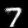

# Restricted Boltzmann Machine
This project builds a RMB. 

## How to use the model
### Install required packages 
tensorflow, numpy, time, os, matplotlib
```
sh requirements.sh
```


### How to use
Example is in `main.py`. In a python file <br />  
Extract MNIST data 
```
mnist = input_data.read_data_sets('MNIST_data', one_hot=True)
```
Create a Restricted Boltzmann Machine with MNIST training data 
```
rbm = RBM(num_visible=784, num_hidden=10,
      train_data=mnist.train.images, epochs=20,
      learning_rate=0.00001)
```
Train the Restricted Boltzmann Machine with the training data
```
rbm.train()
```
### Results 
Number|GIF  
-----------:|:----------------------------:
0|
1|
2|
3|
4|
5|
6|
7|
8|
9|

